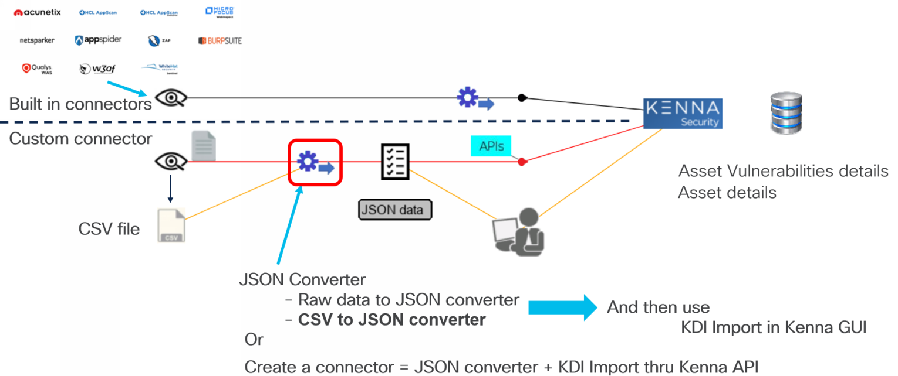
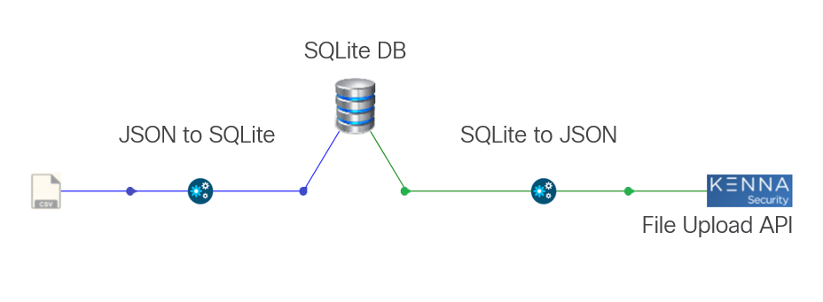

# Python data importer proof of concept

This set of scripts show an example of Kenna Generic Data Importer written in python

## Introduction 

Kenna security needs telemetry from vulnerability scanners in order to acheive Vulnerability pioritization. 

And actually Kenna Security needs any information that can contains information about assets and their associated vulnerabilities. These information use to be the vulnerability scanners results we ingest into kenna backed thanks to built-in connectors.

At the same time kenna provides with a generic data importer feature that can be used to ingest into the backend any data from any relevant sources. This is the Kenna Data importer feature

This feature expect to receive a valid JSON file that contain the asset information. Details about the KDI data JSON format can be found here : [ at this location ](https://help.kennasecurity.com/hc/en-us/articles/360026413111-Kenna-Data-Importer-JSON-Connector-)

In a few words, if we create a valid KDI JSON file for the generic data importer, from any relevant sources, then we can ingest any additionnal asset information that can help kenna security to apply it's datascience.

The question becomes : how can we create a valid KDI JSON data to send to kenna.  This article gives an example of how to acheive that with python.

Second how to send the KDI JSON file to Kenna backend ? We have two option to acheive that. 

The first one is to upload it manually thru the Kenna Connectors console ( Select the JSON file on your hardrive and upload it ).  

The second option is to use a dedicated Kenna API :

https://apidocs.kennasecurity.com/reference/upload-data-file

## Python Proof of Concept description

The proof of concept in this repo, gives an example of parsing data from a exemple of source and ingestion of these data into the kenna backend

As the image bellow shown, in this example we parse data from a source which is actually 2 text files in the JSON format that contains for the first one ( ./init/assets.json ) asset information, and for the second one ( ./init/vulnerabilities.json ) information about asset vulnerabilities.  

These two files are JSON files. They could be results sent by a vulnerability scanner. 

We read these two files, we parse them and extract from them every relevant information we need. This is about assets information and their vulnerabilities. And then we store these information into an SQLite database.

The created database contains 2 tables :

- assets
- vulnerabilities

Fields contained into this table map to same fields of <same table that exist into the Kenna Security backend. Thanks to this the database is ready to futur use cases that could need to duplicate assets and/or vulnerability tables to kenna or vice versa. For this current use case we don't need to use all fields.

Here under table structures :

**assets table :**

- asset_id
- operating_system
- priority
- primary_locator
- locator
- vulnerabilities_count
- status
- ip_address
- hostname
- mac_address
- risk_meter_score

**vulnerabilities tables fields :**

- vulnerability_id : a unique id for this vulnerability
- status
- priority
- identifiers
- asset_id : the asset id of the asset that has this vulnerability
- solution : Description of recommended solution
- cve_id : the CVE ID of this vulnerability if one exist
- cve_description : CVE description
- severity : severity of this vulnerability
- threat :
- popular_target :
- active_internet_breach :
- easily_exploitable :
- malware_exploitable :
- remote_code_execution :
- predicted_exploitable :
- top_priority :
- risk_meter_score : 
- created_at : date & time
- cve_published_at : date & time
- patch_published_at : date & time
- first_found_on : date & time
- last_seen_time : date & time
- due_date text : date & time
- closed_at text : date & time
- closed

**How to do :**

Run the 1-create_sqlite_database_and_json_converter_to_sqlite.py in order to create the SQLite database, parse the sources files and feed the database. The result is supposed to be a new file created into the working directory : database.db. This is the SQLite database.

The 2-update_vulnerability_dates_in_db.py script can be runt in order to update dates of entries stored into the database with the date of the current day. Within kenna, if the dates of entries are too old then data are not displayed. In a demos context could be handy to updates the dates into the database before creating the KDI JSON file.

The reason storing parsed data into a SQLite database instead of direclty convert these data into the KDI JSON result, is to potentially extend the capabilities of the tool for futur usages.

The database becomes a central asset inventory tool we can use to store knowledge of all company assets. And have the capability to feed this database from any interesting inventory tool. Then, As we have in this database all company assets, it is easy to attache to any one of these assets, vulnerabilities discovered by any other tools. And do it on the fly, at any time.  Several tools that discovered vulnerabilities can work in parallel and they can add their sightings into the database at anytime.

The next operation is to read the database and create the KDI JSON files. This operation is done by the 3-sqlite_to_json_for_kdi_converter.py script. The resulting file will be located in the [ ./data_for_kdi ] subfolder named data_for_kdi.json.

This is this file that has to be sent to Kenna Data Importer connector.

The 4-send_JSON_to_KDI.py ( under construction ) send the ./data_for_kdi/data_for_kdi.json to the Kenna Data Importer connector. 
For this script you will need the Connector ID.

## Installation 

Clone this repo into a working directory or download and unzip the zip file into the working directory

These scripts had been created with python 3.11. But they can be runt with 3.7 and +.

They require to python module : requests and crayons. If not already done you have to install them.

    pip install crayons
    pip install requests
    
Once done you can run the scripts. This repo contains demo data into the [ ./init ] subfolder... 2 JSON files we are going to parse 

# Run the scripts

    python 1-create_sqlite_database_and_json_converter_to_sqlite.py
    pyhton 2-update_vulnerability_dates_in_db.py ( optional )
    python 3-sqlite_to_json_for_kdi_converter.py
    python 4-send_JSON_to_KDI.py ( ! this script is under construction ! )
    
## Next step

Have a look at how the parsers work. And specially the SQLite call that ingest the parsed data into th SQLlite database. And then try to transpose ths technic to other sources, like CSV files or interaction with a REST Sources.
    